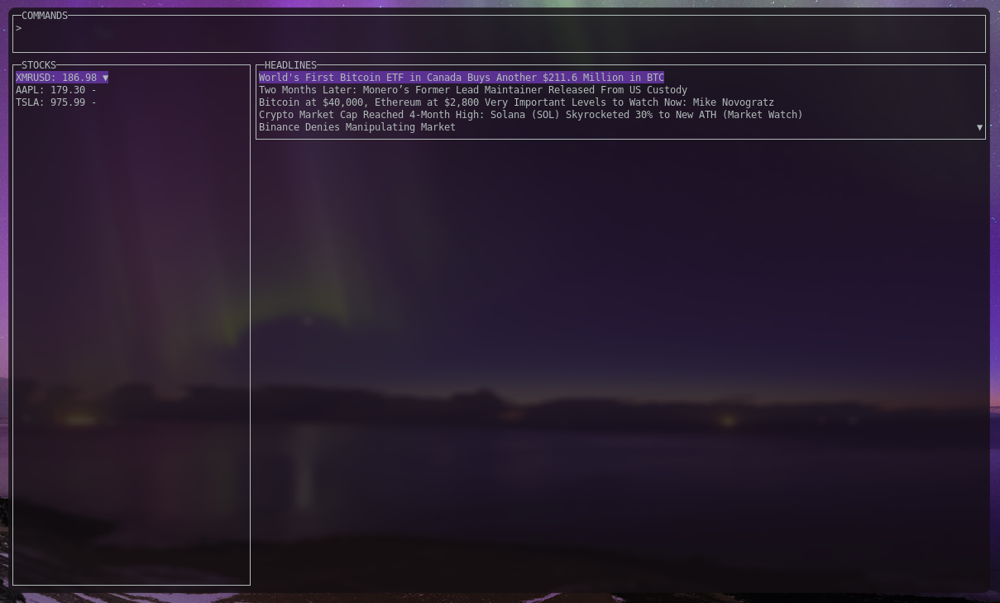

# stockscr

display stock prices in terminal



## Dependencies

```
pisanvs/tradingview-scraper (just copy the main.py to path)
```

## Usage

usage: download pisanvs/tradingview-scraper and copy main.py to path as "tvs" and then just run it lol

it uses vim keybinds so hjkl for movement

you can use `n` to add a new stock (it scrapes it from tradingview so type in something like BINANCE:XMRUSD)